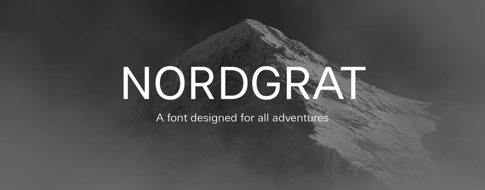
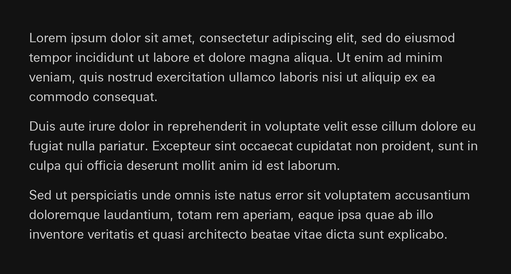

A neo-grotesque typeface designed for all-situations.

## Philosophy

It is a spinnoff from my other project Nordgrat Sans Mono, but adjusted so it feels similar to Univers in terms of spacing and rhythm, but introducing differences in design to incorporate some foreign elements.

- SF Pro & SF Mono from Apple
- Univers from Adrian Frutiger
- Alpes Mono from Sharp Type

## Specimen

## Compile your own custom version

This font is generated with python. Each glyph is drawn from a python glyph class, in which you can inject a drawing context object. You can for example modify some metrics like the x-height, the capital height etc.

To do so, override the config.example.yml with the values of your liking. Be sure to visualize the individual glyphs with `python -m visualize --config config.yml <glyph_id>`. Then you can geneate the full font with `python -m generate_font --config config.yml`. The font files will be generated inside `./custom-fonts`.

> [!WARNING]
> There are no guarantees that the font might look good with different metrics, and some glyphs might require some tweaking if the metrics are altered !
